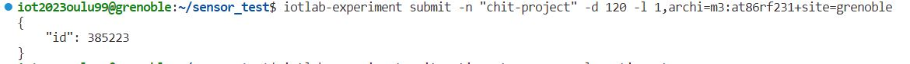

# Chit Project - Optimizing Poultry House Climate for Enhanced Performance

* [Introduction](#Introduction)
* [Background](#Background)
* [Objective](#Objective)
* [Methodology](#Methodology)
* [Conclusion](#Conclusion)
* [Reference](#Reference)

## Introduction

Poultry farming is a delicate process that requires careful monitoring and control of various environmental factors to ensure the health and productivity of the birds. One of the key factors that influence the well-being and productivity of poultry is the climate within the poultry houses. This project aims to optimize the conditions within poultry farms, with a particular focus on temperature regulation, using Internet of Things (IoT) technology. [1]

## Background 

The optimal temperature inside the poultry house is a crucial factor for the well-being and productivity of the birds. An ambient temperature of 30 degrees Celsius is often considered comfortable for the birds. However, this temperature may feel pleasant or oppressive to the birds depending on the relative humidity inside the poultry house.

For instance, with high relative humidity, the birds may perceive the temperature to be higher than the actual ambient temperature. In such cases, the temperature setpoint can be adjusted slightly lower to ensure the birds remain in their thermal comfort zone. Conversely, with lower levels of humidity, the birds may perceive the temperature to be lower than the actual ambient temperature. Therefore, the temperature setpoint can be maintained slightly higher to ensure the birds’ comfort.

In more advanced systems, the temperature and humidity are not controlled separately. Instead, the climate controller determines the temperature setpoint by factoring in the effect of humidity. This approach ensures that the birds always remain in their thermal comfort zone, thereby optimizing their health, welfare, and productivity.

It’s important to note that while an ambient temperature of 30 degrees Celsius is often considered optimal, the actual optimal temperature may vary depending on various factors such as the type of birds, their age, and their health status. Therefore, continuous monitoring and adjustment of the temperature and other environmental conditions are essential for successful poultry farming.


## Objective

The objective of this project is to develop and implement an IoT-based system to monitor and control the temperature within poultry houses accurately. The system will use the IoT-m3 board and the lps331ap sensor to measure not only the ambient temperature but also the relative humidity and wind speed. The data collected will be processed using the RIOT language and the FIT IoT-LAB as the testbed. The ultimate goal is to maintain the birds in their thermal comfort zone, thereby optimizing their health, welfare, and productivity. This project aims to demonstrate the effectiveness of IoT technology in improving the conditions within poultry farms and, consequently, the results of poultry farming.

## Methodology

### Hardware Components:

1. IOT-m3 boards: Used for processing and communication.
2. LPS331AP sensors: Measure temperature within the bird farms.

### Software Components:

1. RIOT OS: Lightweight operating system for IoT devices.
2. C Programming Language: Used for coding the firmware.

### Communication:

1. Utilize the FIT IoT-LAB testbed for remote testing and deployment.

## Implementation:

### Sensor Integration:

**NEED TO EDIT**

Interface with the LPS331AP sensor to measure temperature.
Implement the necessary drivers for the sensor in C using RIOT OS. The main steps are as follows. 

1. The `main.c` is [here.](main.c)

2. The `Makefile` is [here.](Makefile) The path to the `RIOTBASE` directory needs to be changed according to the host. 

3. After creating the files, run the below command on the terminal. This will be submitted for an experiment that lasts for 2 hours/120 minutes. 

```terminal
iotlab-experiment submit -n "chit-project" -d 120 -l 1,archi=m3:at86rf231+site=grenoble
```

The output will look like below. 



4. Next, wait for the experiment to be in the Running state.

```terminal
iotlab-experiment wait --timeout 30 --cancel-on-timeout
```

The output is:


5. The experiment node list can be viewed using the below command.

```terminal
iotlab-experiment --jmespath="items[*].network_address | sort(@)" get --nodes
```

The output is:


6. Before building and flashing the RIOT firmware application on SSH frontend, run the below command on the terminal to ensure that the RIOT related variables are correctly set.

```terminal
source /opt/riot.source
```

7. Build and flash the application using below command.
```terminal
make IOTLAB_NODE=auto flash
```

In this experiment, the output appears as below. 


8. Open a new terminal on the same SSH frontend and run connect to the serial port of the IoT-LAB M3 and observe the value displayed every 2 seconds. The path should be changed according to the host environment. 

```terminal
make IOTLAB_NODE=auto -C /senslab/users/iot2023oulu99/sensor_test term
```

### Data Transmission:

**NEED TO EDIT**


Develop a firmware that periodically reads temperature data.
Use RIOT's networking capabilities to send data to a central server.

### Networking:

**NEED TO EDIT**


Utilize RIOT's network stack for reliable communication.
Ensure the IOT-m3 boards can connect to the FIT IoT-LAB infrastructure.

### Remote Testing:

**NEED TO EDIT**


Deploy the firmware on the FIT IoT-LAB testbed.
Monitor temperature data remotely through the FIT IoT-LAB interface.

## Conclusion
In conclusion, the project emphasizes the critical role of environmental conditions, particularly temperature, in poultry farming and proposes a sophisticated solution through the integration of Internet of Things (IoT) technology. Poultry farming is a complex endeavor where the well-being and productivity of birds are intricately tied to the climate within their houses. Maintaining an optimal ambient temperature is of paramount importance, and this project seeks to address this challenge with a focus on precise temperature regulation using IoT devices.
The background analysis underscores the nuances of temperature perception by poultry, influenced significantly by relative humidity levels. Recognizing that a standard ambient temperature may not universally apply due to variations in factors such as bird type, age, and health status, the project introduces a dynamic approach. This involves adjusting the temperature setpoint based on humidity levels, ensuring the birds consistently experience thermal comfort.
Moreover, the project outlines an objective to develop and implement an IoT-based system for accurate temperature monitoring and control within poultry houses. It introduces specific components, such as the IoT-m3 board and the lps331ap sensor, to measure ambient temperature, relative humidity, and wind speed. Leveraging the RIOT language and the FIT IoT-LAB as a testbed, the system aims to collect and process data effectively to optimize the birds' health, welfare, and productivity.
The provided code snippet demonstrates the practical implementation of the project, showcasing the use of the lpsxxx sensor to read temperature and pressure values. By incorporating commands for temperature and pressure handling, the system enables real-time monitoring and adjustment, aligning with the project's overarching goal of precise environmental control.
This project stands as a testament to the potential of IoT technology in agriculture, specifically poultry farming. By seamlessly integrating sensors, data processing, and control mechanisms, it not only enhances the efficiency of farming operations but also contributes to the well-being of the birds. The significance of continuous monitoring and adjustment in response to dynamic conditions is highlighted, emphasizing a proactive and adaptive approach to poultry farming.
As the agricultural sector continues to embrace technological advancements, projects like these pave the way for sustainable and optimized practices. The convergence of IoT and agriculture holds promise for increased efficiency, reduced resource wastage, and improved animal welfare, aligning with broader goals of promoting responsible and intelligent farming practices.

## Reference 

1. https://www.fancom.com/blog/what-is-the-optimal-temperature-for-poultry#:~:text=The%20birds%20will%20eat%20less,extreme%20temperatures%20can%20cause%20illness.
2. RIOT OS Documentation: https://riot-os.org/
3. FIT IoT-LAB Documentation: https://www.iot-lab.info/
4. [LPS331AP Sensor Datasheet](https://www.alldatasheet.com/datasheet-pdf/pdf/473924/STMICROELECTRONICS/LPS331AP.html)
